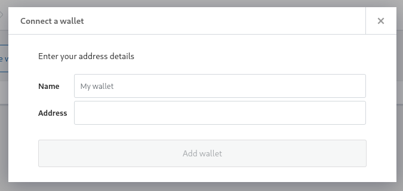
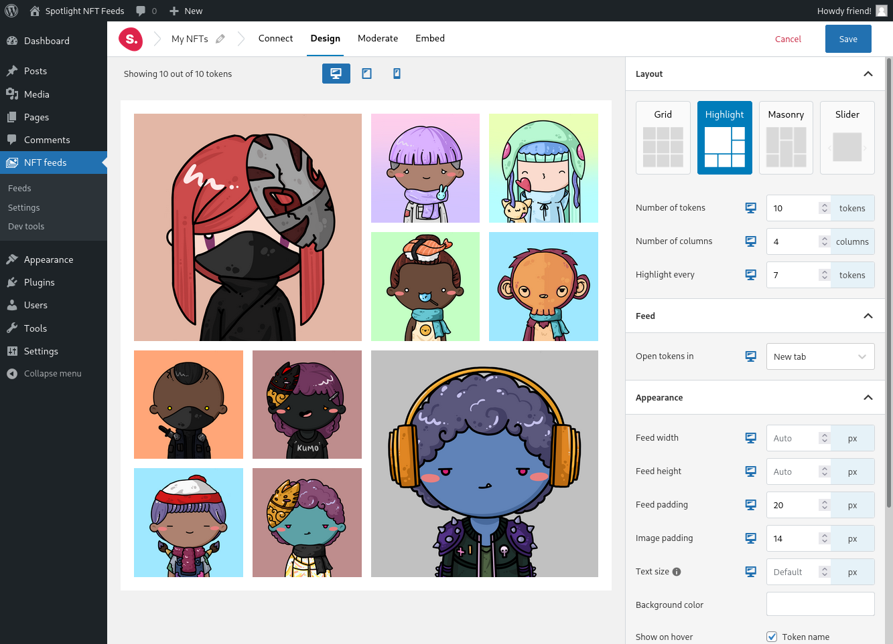
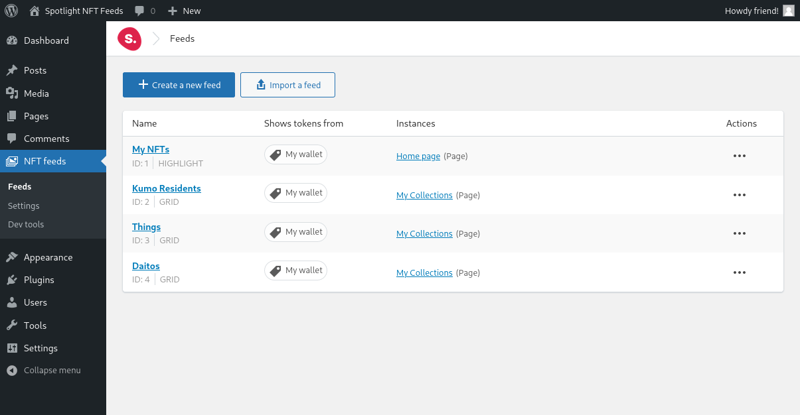

**Spotlight NFT Feeds** is a WordPress plugin that lets you create galleries for
your NFTs.

### Effortless setup

All you need is your wallet address!

### Easy customization

Edit and customize your feeds with Spotlight's intuitive editor and a live preview.

### Unlimited feeds

Create as many feeds as you want, with different wallets or options.

## Download

_Coming soon!_

### Requirements

* **WordPress**: 5.5 or later
* **PHP**: 7.1 or later
* **PHP Extensions**:
  * curl
  * json
  * gd
